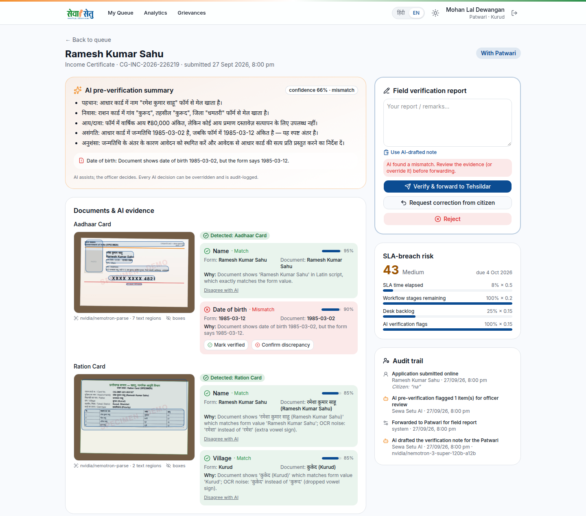
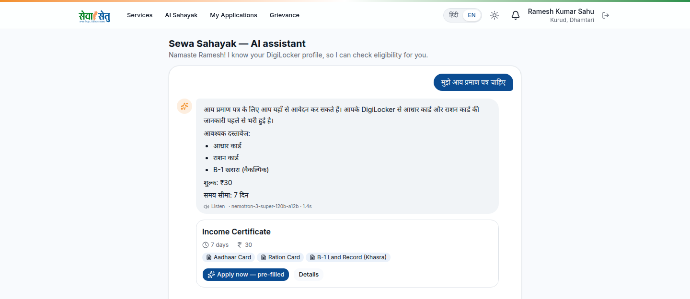
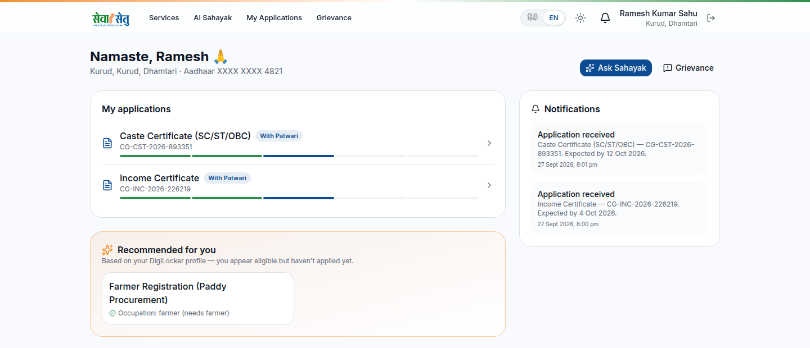
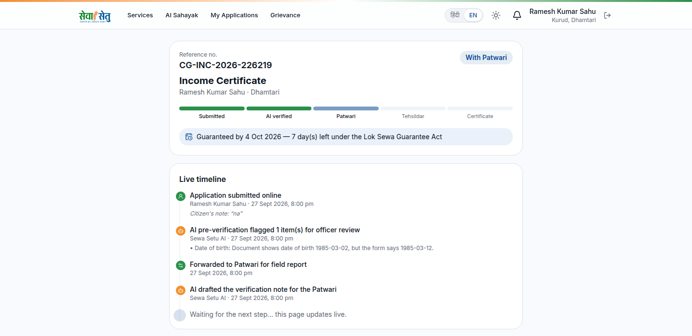
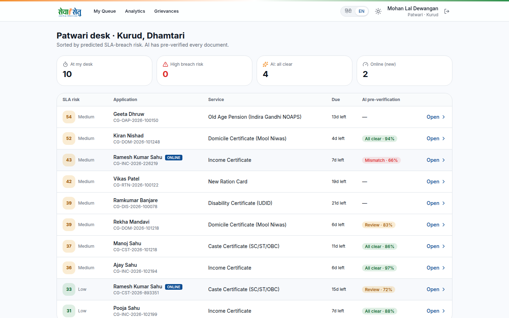
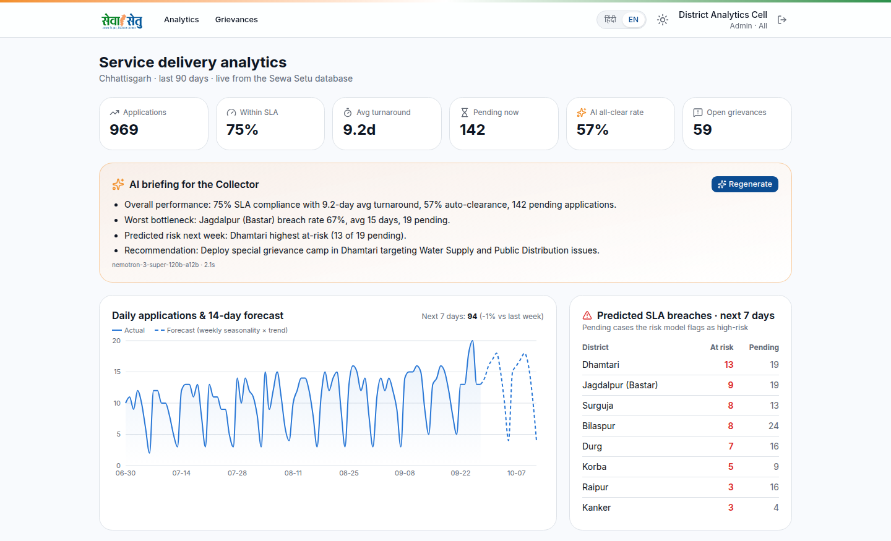
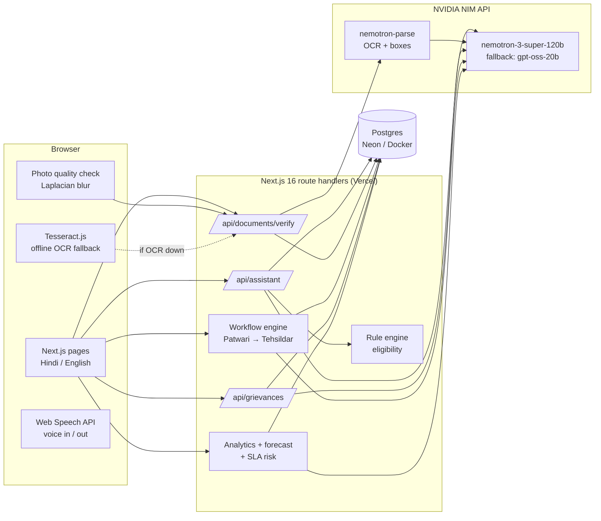

<div align="center">


# Sewa Setu · सेवा सेतु

**AI-powered citizen services for Chhattisgarh: speak, apply, and get documents verified before you submit.**

[](https://sewa-setu-wine.vercel.app)


[The problem](#-the-problem) · [Features](#-what-sewa-setu-does) · [Screenshots](#-screenshots) · [Demo walkthrough](#-demo-walkthrough--4-min) · [Architecture](#%EF%B8%8F-architecture) · [Run locally](#-run-locally) · [Responsible AI](#%EF%B8%8F-responsible-ai)

</div>

---

An AI-first reimagining of Chhattisgarh's **Sewa Setu** portal. A citizen can find a service by speaking in Hindi, apply with a form pre-filled from DigiLocker, and have every document read and cross-checked by AI **before** submission. Officers then work a risk-sorted queue with AI-drafted verification notes, and district administrators see forecasts, SLA-breach predictions and grievance hotspots.

> [!NOTE]
> Built solo in 30 hours for the Sewa Setu hackathon (27–28 Sep 2026). All documents, people and data are **synthetic specimens**; DigiLocker, payments and department systems are mocked. **Not an official government website.**

<p align="center">
  
  <br />
  <sub><i>Every document is read and cross-checked by AI before it reaches the officer, with the evidence, a reason, and a one-click override.</i></sub>
</p>

## 🧩 The problem

Getting an income or caste certificate today often means several trips to a Lok Seva Kendra. A single mismatch (a maiden-name surname, a misspelt village) is usually found by the Patwari weeks later, and the application is sent back to the start.

- **Citizens** can't see where their file is.
- **Officers** can't see which files are about to breach SLA.
- **District officials** find out about systemic problems (a broken water supply in one block) only after the complaints pile up.

## ✨ What Sewa Setu does

### 👤 For citizens

| Feature | AI / technique |
|---|---|
| **Sewa Sahayak**: ask in Hindi or English, by voice or text (*"मुझे आय प्रमाण पत्र चाहिए"*) and get the right service, documents, fee, timeline and *your* eligibility | NVIDIA Nemotron LLM (intent + answer), Web Speech API (voice in/out), deterministic rule engine for eligibility |
| **Pre-filled application** from the DigiLocker profile | Mock DigiLocker consent flow |
| **Photo quality check** on the phone: blurry, dark or glare photos rejected instantly, before upload | Laplacian-variance sharpness + brightness, in the browser |
| **AI document verification**: reads Aadhaar, ration card, caste certificate, B-1 land record etc., detects the document type, extracts fields and compares each to the form, with a confidence score and a plain-language reason | `nvidia/nemotron-parse` OCR (with bounding boxes) → Nemotron LLM extraction & comparison → deterministic date / fuzzy-match guards |
| Mismatches explained **with a fix** (e.g. *surname Markam on Aadhaar vs Dhruw on form → attach marriage certificate*) | LLM reasoning; the citizen can add a note |
| **Real-time tracking**: timeline, SLA countdown, live status toasts, notification bell | 3-second polling |
| **Proactive recommendations**: *"you may also be eligible for…"* | Rule engine over the citizen profile |
| **Grievances** by voice: auto-categorised, prioritised with a reason, routed to the right department and district, grouped into hotspots | LLM triage + SQL clustering |

### 🧑‍💼 For officers

| Feature | AI / technique |
|---|---|
| **Queue sorted by SLA-breach risk**, with the factors shown | Explainable risk score (time used, AI verdict, queue depth) |
| **AI-drafted verification note in Hindi** for the Patwari, one click to use it | Nemotron LLM |
| **Explainable AI + human override**: every AI check shows its evidence (bounding boxes on the document image); officers can override any check and it's audit-logged | Audit trail of every event |
| Patwari → Tehsildar workflow; approval issues a **bilingual certificate with a QR code** that anyone can verify at `/verify/<no>` | Config-driven workflow engine |

### 📊 For district administrators

| Feature | AI / technique |
|---|---|
| **Analytics**: 14-day demand forecast, breach rate by district, predicted breaches in the next week, grievance hotspots, and an **AI briefing for the Collector** | Seasonality × trend forecast, risk model, LLM summary |

**17 services** are in the catalog, all config-driven in [`src/lib/services.ts`](src/lib/services.ts). Income, caste and domicile certificates have the full AI apply flow; adding another is a config entry, not new code.

## 📸 Screenshots

<table>
  <tr>
    <td width="50%"><p align="center"><b>Sewa Sahayak</b>: ask in Hindi, get the service, documents and fee</p></td>
    <td width="50%"><p align="center"><b>Citizen dashboard</b>: applications, notifications, recommendations</p></td>
  </tr>
  <tr>
    <td width="50%"><p align="center"><b>Live tracking</b>: SLA countdown and an audit-backed timeline</p></td>
    <td width="50%"><p align="center"><b>Officer queue</b>: sorted by breach risk, AI verdict per file</p></td>
  </tr>
  <tr>
    <td colspan="2"><p align="center"><b>District analytics</b>: KPIs, AI briefing for the Collector, 14-day forecast, predicted breaches</p></td>
  </tr>
</table>

## 🎬 Demo walkthrough (≈ 4 min)

> [!TIP]
> Use the **role switcher** (bottom-right) to jump between personas. **Reset demo** restores the seed data.

| Persona | Who | Shows |
|---|---|---|
| **Ramesh Kumar Sahu** | OBC farmer, Kurud, Dhamtari | The happy path: voice search → apply → all checks match |
| **Priya Verma** | SC student, Raipur | The caste certificate flow |
| **Sunita Dhruw** | ST homemaker, Nagri | The name-mismatch case |

1. **Home → 🎤 → "मुझे आय प्रमाण पत्र चाहिए"** (as Ramesh). Sahayak answers in Hindi, reads it aloud, and shows the income certificate with *You are eligible*.
2. **Apply**: the form is pre-filled from DigiLocker. On Documents, upload [`public/demo-docs/ramesh_ration_card_blurry.jpg`](public/demo-docs/ramesh_ration_card_blurry.jpg) → rejected on-device (sharpness 1 vs 120). Then *Fetch from DigiLocker* for Aadhaar and ration card → OCR boxes and all checks **Match**. Submit.
3. **Switch to Sunita**, apply for an income certificate → Aadhaar says *Sunita Markam*, form says *Sunita Dhruw* → **Mismatch** with the reason and a suggested fix, before submission.
4. **Switch to Patwari**: Ramesh's application is in the risk-sorted queue with the AI-drafted Hindi note, evidence and override buttons → Forward. **Switch to Tehsildar** → Approve → certificate with QR code.
5. **Switch back to Ramesh**: the tracking page has updated live, with the certificate link and recommendations for other schemes.
6. **Grievance**: *"जगदलपुर में 2 हफ्ते से पानी नहीं आ रहा"* → *Water Supply · Public Health Engineering*, a priority with its reason, and grouped with the similar Jagdalpur complaints as a hotspot.
7. **Switch to Admin → Analytics**: forecast, Surguja and Bastar breaching SLA at ~3× the state average, predicted breaches, and the AI briefing.

## 🏗️ Architecture



### 🔍 AI document-verification pipeline

1. **On device**: the image is scaled to 1648 px on the long side (best for Nemotron-Parse, and it keeps Devanagari vowel signs), sharpness and brightness are checked, and a SHA-256 is computed.
2. **OCR**: `nvidia/nemotron-parse` returns text blocks with bounding boxes. Its reads vary run to run (a region can come back `<unknown>`), so the image is read three times in parallel and the read whose words the other reads confirm is kept. Markdown / LaTeX artefacts are cleaned.
3. **Extraction and comparison**: a Nemotron LLM detects the document type, extracts the fields that service needs, and compares each to the form: `match` / `partial` / `mismatch` / `missing`, with a confidence score and a reason. Prompt rules cover Hindi-English transliteration, OCR noise in Devanagari, and "a different surname is always a mismatch".
4. **Deterministic guards**: every value the model reports must be quoted from the OCR text, and code checks that quote, so a misread document becomes "missing" and never "matches" by echoing the form. Dates are normalised and compared in code, and a Levenshtein similarity ≥ 0.8 downgrades a "mismatch" to "partial", so an OCR slip like *Sinhawa* for *Sihawa* doesn't block a citizen.
5. **Aggregate**: a score and verdict per application, which the officer sees and can override.

### 🛡️ Reliability (why the demo doesn't break)

- Every AI call has a timeout, one retry when the hosted API is overloaded, and a fallback model (`nemotron-3-super-120b` → `gpt-oss-20b`), which also takes over if a reply isn't valid JSON.
- If the LLM is unavailable, the officer still gets a rule-based verification note built from the same checks.
- If cloud OCR is unreachable, the browser runs **Tesseract.js (Hindi + English) on-device** and the server verifies that text.
- Real results are cached by image hash; if the live pipeline fails, the cached **real** result is served with a visible "cached" badge.
- Sahayak falls back to keyword search over the catalog if the LLM is down.
- **Eligibility is never decided by the LLM**: a rule engine decides it, and those results are given to the LLM as facts it may not contradict.

## 🧰 Tech stack

| Layer | Tools |
|---|---|
| Framework | Next.js 16 (App Router), React 19, TypeScript |
| UI | Tailwind v4, shadcn/ui (Base UI), Recharts, `qrcode` |
| Data | Drizzle ORM + PostgreSQL (Neon in production, Docker locally) |
| AI | NVIDIA NIM API (Nemotron-Parse, Nemotron-3 Super), Tesseract.js, Web Speech API |
| Hosting | Vercel |

## 🚀 Run locally

**Requirements:** Node 22+, pnpm, Docker, and an NVIDIA API key from [build.nvidia.com](https://build.nvidia.com).

```bash
pnpm install
cp .env.example .env          # add NVIDIA_API_KEY; DATABASE_URL points to the Docker DB
docker compose up -d          # Postgres 17 on localhost:5433
pnpm db:push                  # create tables
pnpm seed                     # 3 personas, 3 officers, ~90 days of history, grievances
pnpm dev                      # http://localhost:3000
```

Demo documents are in [`public/demo-docs/`](public/demo-docs) (regenerate with `python scripts/make_demo_docs.py`). `scripts/dev/e2e.mts` runs the full citizen → Patwari → Tehsildar flow against a running server.

<details>
<summary><b>🗺️ Project map</b></summary>

```
src/lib/services.ts     service catalog, form fields, document rules, eligibility engine
src/lib/ai.ts           NVIDIA NIM client: timeouts, model fallback, JSON extraction, OCR
src/lib/verify.ts       document verification pipeline + guards + cache
src/lib/workflow.ts     submit, officer actions, AI officer note, overrides, audit events
src/lib/risk.ts         explainable SLA-breach risk
src/lib/analytics.ts    KPIs, forecast, district breach rates, hotspots
src/lib/image-client.ts browser-side compression, blur check, hashing, Tesseract
src/db/                 Drizzle schema + deterministic seed
src/app/                pages (citizen, officer, admin) and API route handlers
```

</details>

## 🔮 What is mocked, and what would come next

| Mocked in the prototype | Production path |
|---|---|
| DigiLocker login and document fetch (3 personas) | DigiLocker Requester API (OAuth + pull URIs) |
| Payment ("UPI — demo, not charged") | PayGov / state payment gateway |
| Officer logins | e-Pramaan / state SSO with role mapping |
| Notifications (in-app) | SMS / WhatsApp via the state gateway |
| Land records shown as an uploaded B-1 | Bhuiyan land-record API lookup |
| Seeded history and grievances | Existing Sewa Setu / Jan Shikayat data |

**Next steps:** WhatsApp channel, Chhattisgarhi and Gondi voice, face-match against the Aadhaar photo, fine-tuning the extractor on real (consented) document sets, and a bias audit of the risk model across districts.

## ⚖️ Responsible AI

- The AI **assists and explains**, it never rejects. Every automated check shows its evidence and can be overridden by an officer, and every action is in the audit trail.
- Citizens see the same reasons the officer sees, so they can fix problems themselves.
- Eligibility and dates use deterministic code, not LLM judgement.
- The Aadhaar number is masked everywhere; document images stay in the application's own database.

---

<div align="center">

Made for the **Sewa Setu hackathon** · Prototype only, not affiliated with the Government of Chhattisgarh.

</div>
